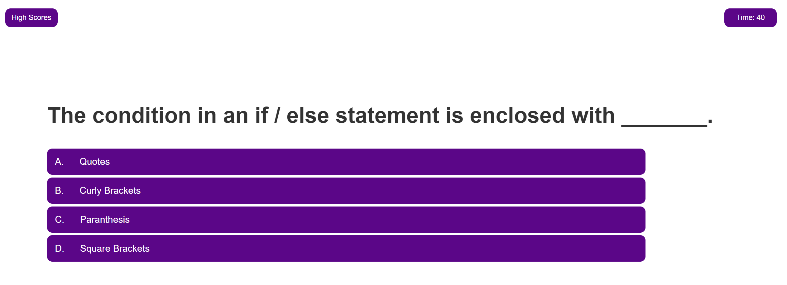

# Timed-Quiz

This is the fourth challenge of my UW coding bootcamp curriculum.

For this challenge, we had to follow the acceptance criteria to create a short timed quiz game with a set of rules

The user is instructed to answer the question presented to them. If a choice is answered incorrectly, 5 seconds is subtracted from the current timer. When a question is answered, the next question is displayed. When all questions are answered or the timer reaches 0, the user is sent to the end-screen where they can input initials and save their score.

This code was created from scratch using ideas from a variety of resources

View a screenshot of the quiz below

View the deployed site [Here:](https://noahbrown26.github.io/Timed-Quiz/)

